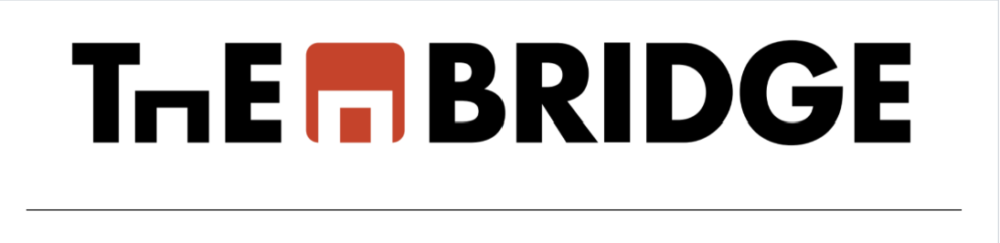

# API RESTful para gestionar productos - MongoDB + Node.js + Express

## 🧾 Introducción

MongoDB es un sistema de gestión de bases de datos (DBMS) de código abierto que utiliza un modelo de base de datos orientado a documentos.

A diferencia de las bases de datos relacionales que usan tablas y filas, MongoDB emplea **colecciones** y **documentos**, con una estructura similar a JSON que permite mayor flexibilidad.

Este proyecto consiste en una API RESTful desarrollada con **Node.js**, **Express** y **MongoDB Atlas** que permite gestionar productos (crear, leer, actualizar y eliminar) de manera sencilla y modular.

---

## 🎯 Objetivos del Proyecto

- Comprender qué es una base de datos no relacional.
- Aprender cómo realizar consultas a bases de datos no relacionales.
- Analizar y diseñar bases de datos con sus correspondientes colecciones.
- Interactuar con los datos almacenados usando una API REST.

---

## 🔌 1. Conexión a MongoDB Atlas

1. Crear una cuenta en [MongoDB Atlas](https://www.mongodb.com/cloud/atlas).
2. Crear un **Cluster** y una base de datos (`api_summer_products`).
3. Obtener la cadena de conexión y configurarla en un archivo `keys.js`:

// keys.js

module.exports = {
MONGO_URI: "mongodb+srv://<usuario>:<contraseña>@<cluster>.mongodb.net/api_summer_products?retryWrites=true&w=majority"
};

### Establecer la conexión en config/config.js:

const mongoose = require("mongoose");
const { MONGO_URI } = require("./keys");

const dbConnection = async () => {
try {
await mongoose.connect(MONGO_URI, {
useNewUrlParser: true,
useUnifiedTopology: true,
});
console.log("Base de datos conectada con éxito");
} catch (error) {
console.error(error);
throw new Error("Error al conectar a la base de datos");
}
};

module.exports = { dbConnection };

## 🔁 2. Endpoints de la API

### Crear un producto (POST)

URL: /api/products
Método: POST
Body:

{
"name": "Sombrilla de playa",
"price": 25
}

### Obtener todos los productos (GET)

URL: /api/products
Método: GET

### Obtener un producto por ID (GET)

URL: /api/products/:id
Método: GET

### Buscar productos por nombre (GET)

URL: /api/products/search/:name
Método: GET

### Actualizar un producto (PUT)

URL: /api/products/:id
Método: PUT
Body: (ejemplo)
{
"price": 30
}

### Eliminar un producto (DELETE)

URL: /api/products/:id
Método: DELETE

📂 Estructura del Proyecto

📁 config

└── config.js

└── keys.js

📁 controllers

└── productController.js

📁 models

└── product.js

📁 routes

└── productRoutes.js

📄 index.js

📄 package.json

📄 README.md

En package.json:

"scripts": {
"start": "node index.js",
"dev": "nodemon index.js"
}
Ejecutar con:

npm run dev

## 🧪 Pruebas con Postman

- Usar Postman para probar los endpoints descritos.

- Insertar productos como artículos de verano (ej. playa, piscina).

- Verificar que los productos aparezcan también en MongoDB Atlas.

## 🧠 Conclusión

El presente proyecto ofrece una introducción práctica al uso de bases de datos no relacionales con MongoDB Atlas y la construcción de una API RESTful con Node.js, permitiendo comprender los fundamentos del diseño y manejo de colecciones, así como la interacción con datos usando herramientas modernas.
